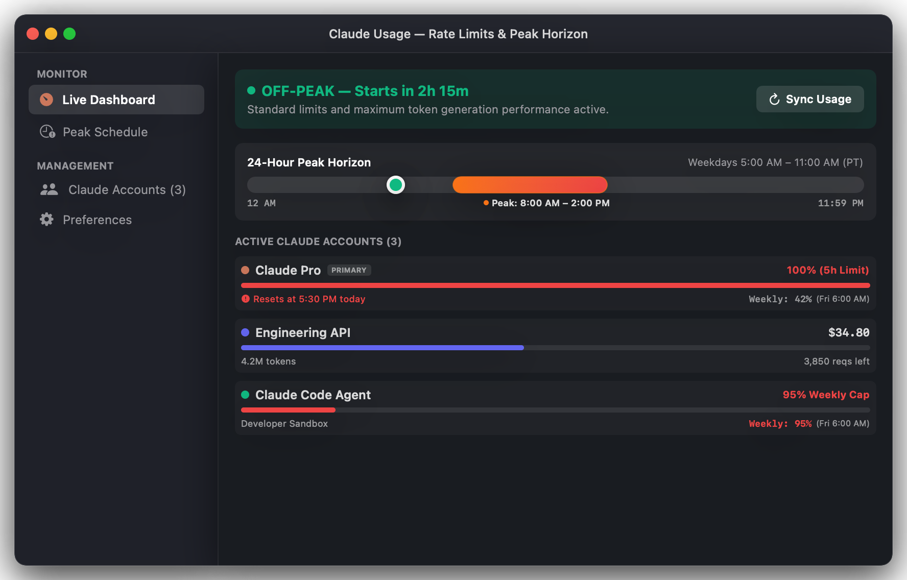
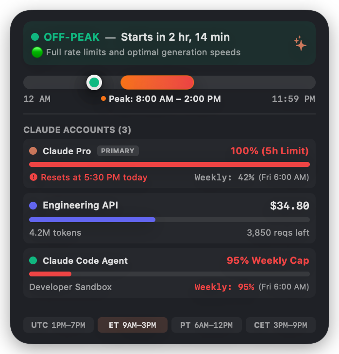
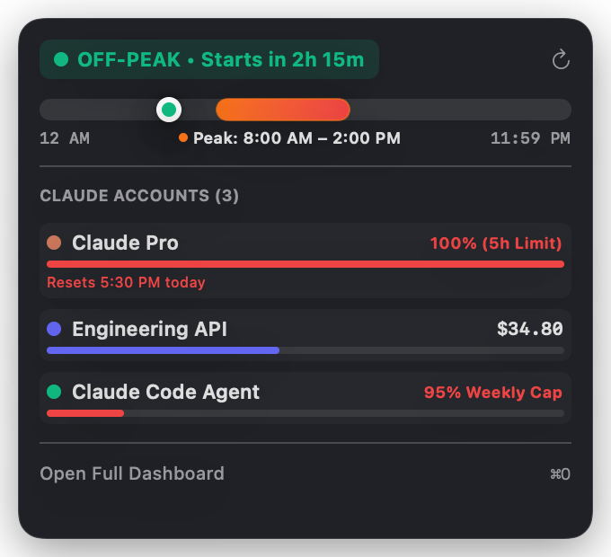
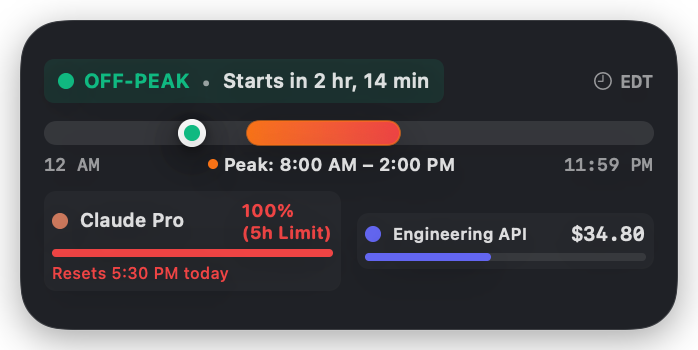
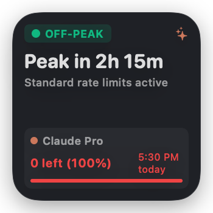
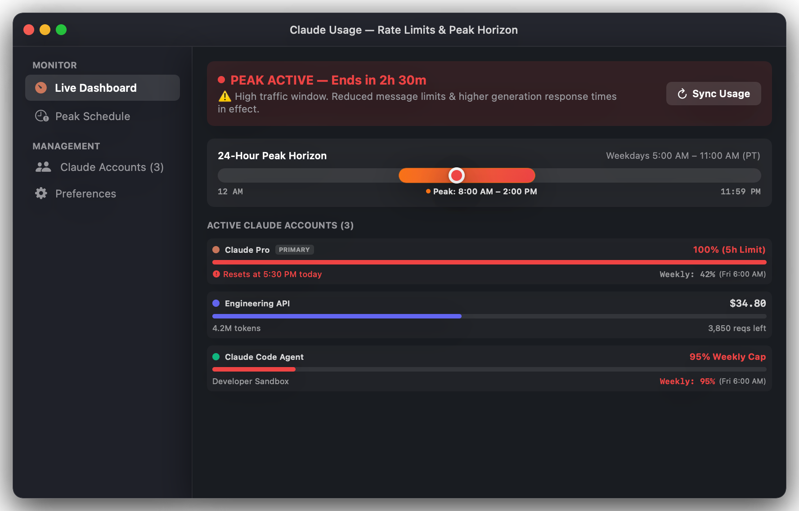
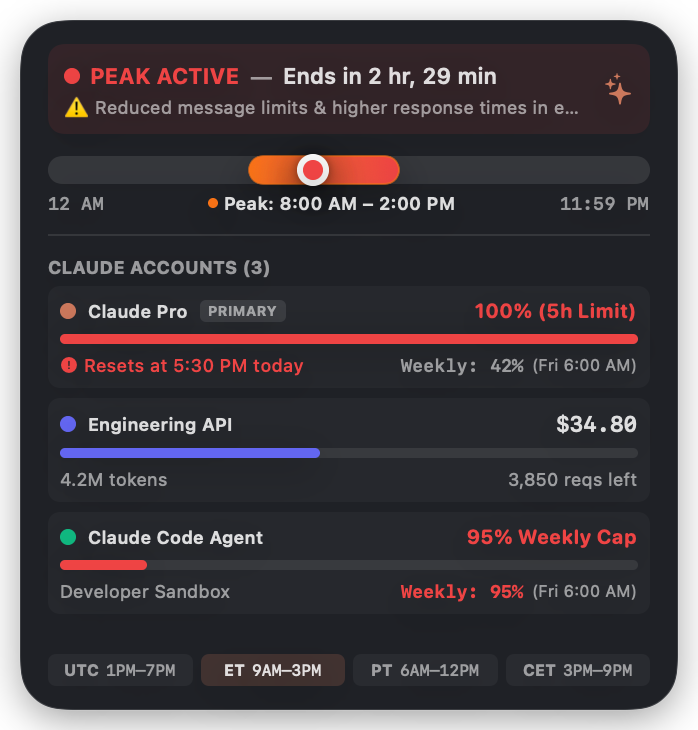
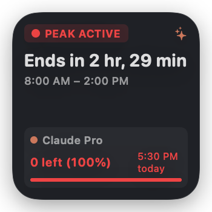
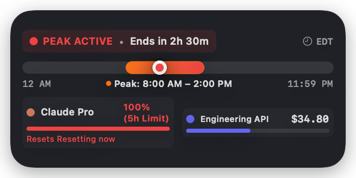

# Claude Usage & Peak Time Tracking for macOS

A native macOS menu bar app and WidgetKit desktop suite built with **SwiftUI** and **Swift 6** for tracking Claude usage across multiple accounts and monitoring Claude's global peak hours in real time.

>[!NOTE]
>### 💡 Why Claude Usage?
> **Are you a Claude user? Do you have one or multiple accounts?**
>
> If you rely heavily on Claude for coding, research, or daily workflows, you've almost certainly hit that dreaded mid-flow roadblock: suddenly Anthropic gouges your session limits or throttles response speeds during **weekday peak traffic hours** right when you need it most.
>
> I built **Claude Usage** to take the guesswork out of rate limits. Whether you manage a personal Claude Pro account, an enterprise workspace, heavy Claude Code agent sessions, or direct Anthropic API keys, this app gives you complete, real-time visibility over:
> - **Peak Hour Horizon**: Real-time tracking of Claude's global peak traffic windows (**Weekdays 1:00 PM – 7:00 PM UTC / 9:00 AM – 3:00 PM ET / 6:00 AM – 12:00 PM PT**) — when session limits drain faster than usual.
> - **Live Session & Weekly Limits**: Instant visibility into your 5-hour rolling session limit, 7-day volume cap, and exact clock-based reset times (e.g., `"Resets at 5:30 PM today"` and `"Weekly: 95% (Fri 6:00 AM)"`).
> - **Multiple Interfaces**: Seamless access via a full **macOS Desktop Dashboard**, a lightweight **Menu Bar Popover**, and native **Desktop Widgets across all sizes (Small, Medium, Large)** directly on your desktop wallpaper or Notification Center.

<p align="center">
  
</p>

---

## 📦 Download & Installation

The easiest way to install Claude Usage is to download the pre-built `.dmg` from [GitHub Releases](https://github.com/quincarter/ClaudeUsage-MacOS-App-Widget/releases):

[-007AFF?style=for-the-badge&logo=apple&logoColor=white)](https://github.com/quincarter/ClaudeUsage-MacOS-App-Widget/releases/latest/download/ClaudeUsage-v1.1.0.dmg)
[](https://github.com/quincarter/ClaudeUsage-MacOS-App-Widget/releases/latest)

1. Download [**ClaudeUsage-v1.1.0.dmg**](https://github.com/quincarter/ClaudeUsage-MacOS-App-Widget/releases/latest/download/ClaudeUsage-v1.1.0.dmg).
2. Open the `.dmg` and drag **ClaudeUsage.app** into your **Applications** folder.
3. Launch **ClaudeUsage** from `/Applications`.

> [!NOTE]
> **First Launch on macOS (Gatekeeper)**:
> Because this open-source app is signed ad-hoc without an Apple Developer ID certificate, macOS will show a security prompt on first launch.
> - **Option 1**: Right-click (or Control-click) `ClaudeUsage.app` in your Applications folder and click **Open**, then confirm **Open**.
> - **Option 2**: Run this one-line command in Terminal:
>   ```bash
>   xattr -cr /Applications/ClaudeUsage.app
>   ```

---

## 📸 Desktop Widgets & Menu Bar

Monitor your active accounts and peak status at a glance from your macOS Desktop or Notification Center.

<p align="center">
  
  &nbsp;&nbsp;&nbsp;&nbsp;
  
</p>

<p align="center">
  
  <br><br>
  
</p>

| Size | Focus | Key Information |
| :--- | :--- | :--- |
| **Large Widget** | Comprehensive multi-account overview | Live 5h limits with clock-based reset times (`Resets at 5:30 PM today`), 7-day weekly cap, spend & token meters, 24h illuminated daylight timeline, and regional reference pills. |
| **Medium Widget** | Daylight horizon & side-by-side accounts | Visual peak horizon bar, current time indicator needle, and primary & secondary account usage cards. |
| **Small Widget** | Compact glanceability | Peak status badge, countdown timer, and primary account quota meter. |
| **Menu Bar Extra** | Quick access popover | Live menu bar icon, 1-click usage synchronization, and fast dashboard access (`⌘O`). |

---

## ⚡️ Peak Hours Active State

During Claude's weekday peak traffic windows (**Monday–Friday, 1:00 PM – 7:00 PM UTC**), the desktop widgets and application automatically switch into **Peak Active** mode. Session limits drain faster than usual, status indicators turn red, the daylight needle tracks inside the illuminated peak band, and live countdowns display exactly when standard rates resume.

<p align="center">
  
</p>

<p align="center">
  
  &nbsp;&nbsp;&nbsp;&nbsp;
  
</p>

<p align="center">
  
</p>

---

## ✨ Features

- **Peak Window Detection**: Accurately tracks Claude's peak window (**Weekdays Monday–Friday, 1:00 PM to 7:00 PM UTC**). Weekends are automatically recognized as off-peak all day.
- **Regional Timezone Horizon**: Dynamically converts peak windows for your local device timezone and key regions:
  - **Coordinated Universal Time (UTC)**: 1:00 PM – 7:00 PM
  - **Eastern Time (ET)**: 9:00 AM – 3:00 PM (EDT) / 8:00 AM – 2:00 PM (EST)
  - **Pacific Time (PT)**: 6:00 AM – 12:00 PM (PDT) / 5:00 AM – 11:00 AM (PST)
  - **Central European Time (CET / CEST)**: 3:00 PM – 9:00 PM (CEST) / 2:00 PM – 8:00 PM (CET)
- **Multi-Account Monitoring**:
  - **Claude.ai Web Sessions**: Live synchronization of 5-hour rolling session limit (`five_hour`) and 7-day weekly volume cap (`seven_day`), including surface breakdown (Claude Code, Artifacts, Web Chat).
  - **Clock-Based Reset Times**: Shows exact reset times like `"Resets at 5:30 PM today"` and `"Weekly: 95% (Fri 6:00 AM)"`.
  - **Anthropic API**: Track token usage (input/output/total), spend ($ USD), and rate limit headers.
  - **Local Rolling Window Tracker**: Privacy-first, local message tracker with quick "+1 Prompt" button and reset countdowns.
- **Keychain Security**: All sensitive API keys and session tokens are encrypted in the native macOS Keychain.
- **Instant Cross-Process Sync**: WidgetKit timelines automatically redraw whenever accounts refresh or usage updates in the app.

---

## 🛠 Tech Stack & Architecture

- **Platform**: macOS 14.0+ (Sonoma, Sequoia)
- **UI Framework**: SwiftUI & WidgetKit
- **Language**: Swift 6 (Strict Concurrency Checking)
- **Project Generator**: [XcodeGen](https://github.com/yonaskolb/XcodeGen) (`project.yml`)
- **Shared Framework**: `ClaudeUsageShared.framework` linking models, services, and shared UI components across the host app, widgets, and tests.

---

## 🚀 Quick Start

### 1. Prerequisites
Ensure you have Xcode 15+ installed. If you wish to regenerate the project file from `project.yml`:
```bash
brew install xcodegen
```

### 2. Generate and Open Project
```bash
xcodegen generate
open ClaudeUsage.xcodeproj
```

### 3. Run Unit Tests & Screenshot Generation
```bash
xcodebuild test -project ClaudeUsage.xcodeproj -scheme ClaudeUsageTests
```

### 4. Build & Install
```bash
xcodebuild build -project ClaudeUsage.xcodeproj -scheme ClaudeUsage -configuration Debug
```
Copy `ClaudeUsage.app` to `/Applications/` to enable WidgetKit discovery in macOS desktop widget gallery.

### 5. Package as DMG Installer
To build the Release configuration and package it into a compressed `.dmg`:
```bash
./scripts/build_dmg.sh v1.1.0
```
This outputs `dist/ClaudeUsage-v1.1.0.dmg` with `/Applications` drag-and-drop installer.

---

## 📄 License
MIT License. Feel free to use, modify, and distribute.
